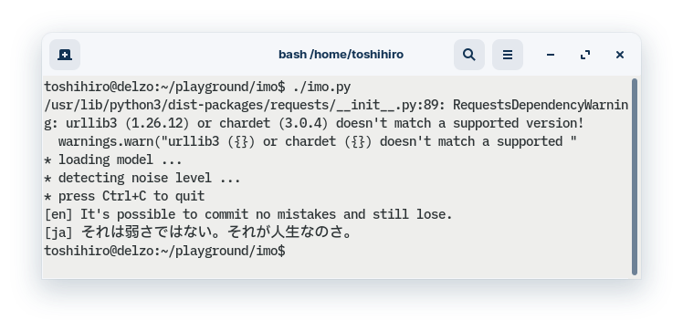

imo
====

A command-line interactive transcription tool using whisper.

## Prerequisites:

Tool imo has dependencies that cannot be installed by pip alone.
Install each dependency according to its installation instructions.

(1) Whisper

Follow the "Setup" instruction on the page https://github.com/openai/whisper

(2) PyAudio

Follow the "Installation" instruction on the page https://pypi.org/project/PyAudio/

(3) `numpy` and `docopt` (or `docopt-ng`).

```sh
pip install numpy
pip install docopt
```

## Run

Run imo.py.

```sh
imo.py
```

When you see "press Ctrl+C to quit", you are ready to go.

Try speaking something into the microphone. When you finish speaking, the text will be displayed. After that, every time you speak, the content of your speech will be transcribed and displayed.

To quit, press Ctrl+C.

A Screenshot.


